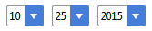

# bresson

Does the world need another date picker? Probably not. We have all used [JQuery][jquery]'s' and
if you're operating in angular territory, chances are you're familiar with the ones from
[angular ui][ui] or [angularstrap][strap].

Nothing's wrong with those, but lately, I tend to use HTML5's date input. It's simple to
use, looks good (also on mobile) and frankly, gives me a lot less configuration troubles than some of the 
other options (working with dates can be such a pain in webland). Unfortunately not all browsers 
support this element. 

Using one of the aforementioned date pickers as a fallback could be an option, but then I have to do
the extra configuration, styling etc... anyway, and also I don't like it when my fallback solution is 
looking fancier then my default solution.

Hence this simple, minimalistic date input, using vanilla select elements to pick days, months and years. 

Here's what it looks like:



## Getting Started

Download the [production version][min] or the [development version][max].

In your index.html:

```html
<script src="angular.js"></script>
<script src="dist/bresson.min.js"></script>
```
In your template page:

```html
<br-date-selector date="ctrl.currentDate"/>
```

## Documentation

In its simplest form, you use it like so:

```html
<br-date-selector date="ctrl.currentDate"/>
```

Note that *if* the browser supports HTML5's date input, that one will be used, otherwise we'll fallback to the
bresson date selector. Should you prefer to always use the fallback, you should set the 'tryDateInput'
attribute to false:

```html
<br-date-selector date="ctrl.currentDate" try-date-input="false"/>
```

By default, the 'years' select will offer 100 years, 50 before and 50 after the given modelDate. You can change this
by specifying a 'fromYear' and 'toYear' attribute:

```html
<br-date-selector date="ctrl.currentDate" 
                  try-date-input="false"
                  from-year="2000" 
                  to-year="2100"/>
```

Note that it's not possible to specify only 1 of these attributes. If you specify one, you have to specify the 
other as well.

The order of the select boxes, i.e. of the day and month selects, is defined by the locale dateformat settings. If 
you'd like to override this, you can pass the 'dayBeforeMonth' attribute:

```html
<br-date-selector date="ctrl.currentDate" 
                  try-date-input="false"
                  day-before-month="true"/>
```

Finally you can also pass a css class and a placeholder (for the default date input) like so:

```html
<br-date-selector date="ctrl.currentDate" 
                  br-attributes="{'class' : 'required', 'placeholder' : 'reservation date'}"/>
```


## Examples

<p data-height="213" data-theme-id="0" data-slug-hash="WQzRaa" data-default-tab="result" data-user="david_bulte" class='codepen'>See the Pen <a href='http://codepen.io/david_bulte/pen/WQzRaa/'>Using bresson datepicker</a> by David (<a href='http://codepen.io/david_bulte'>@david_bulte</a>) on <a href='http://codepen.io'>CodePen</a>.</p>
<script async src="//assets.codepen.io/assets/embed/ei.js"></script>

## Robert Bresson

[][bresson]

<!--
[Robert Bresson][bresson] was a French film maker, member of the Nouvelle Vague. 
[Pickpocket][pickpocket], his masterpiece, is a minimalistic account of 
Ken Loach, Dogma
-->
[min]: https://rawgit.com/david-bulte/bresson/master/dist/bresson.min.js
[max]: https://rawgit.com/david-bulte/bresson/master/dist/bresson.js
[jquery]:https://jqueryui.com/datepicker/
[ui]:https://github.com/angular-ui/bootstrap/tree/master/src/datepicker
[strap]:http://mgcrea.github.io/angular-strap/#/datepickers
[bresson]:https://en.wikipedia.org/wiki/Robert_Bresson
[pickpocket]:https://en.wikipedia.org/wiki/Pickpocket_(film)
